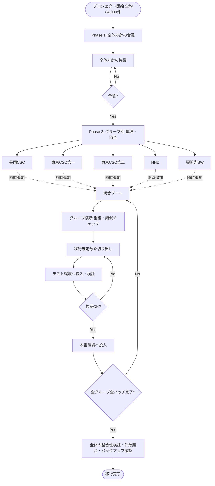

```mermaid
flowchart TD
    Start(["プロジェクト開始 全約84,000件"])

    Start --> P1

    P1["Phase 1: 全体方針の合意"]
    P1 --> P1_1["全体方針の協議"]
    P1_1 --> P1_2{"合意?"}
    P1_2 -- No --> P1_1
    P1_2 -- Yes --> P2

    P2["Phase 2: グループ別 整理・精査"]

    P2 --> G1["長岡CSC"]
    P2 --> G2["東京CSC第一"]
    P2 --> G3["東京CSC第二"]
    P2 --> G4["HHD"]
    P2 --> G5["顧問先SW"]

    G1 -. "随時追加" .-> POOL
    G2 -. "随時追加" .-> POOL
    G3 -. "随時追加" .-> POOL
    G4 -. "随時追加" .-> POOL
    G5 -. "随時追加" .-> POOL

    POOL["統合プール"]
    POOL --> CROSS["グループ横断 重複・類似チェック"]
    CROSS --> FIX["移行確定分を切り出し"]

    FIX --> TEST["テスト環境へ投入・検証"]
    TEST --> TEST_Q{"検証OK?"}
    TEST_Q -- No --> FIX
    TEST_Q -- Yes --> PROD["本番環境へ投入"]

    PROD --> ALL_Q{"全グループ全バッチ完了?"}
    ALL_Q -- No --> POOL
    ALL_Q -- Yes --> FINAL

    FINAL["全体の整合性検証・件数照合・バックアップ確認"]
    FINAL --> End(["移行完了"])
```